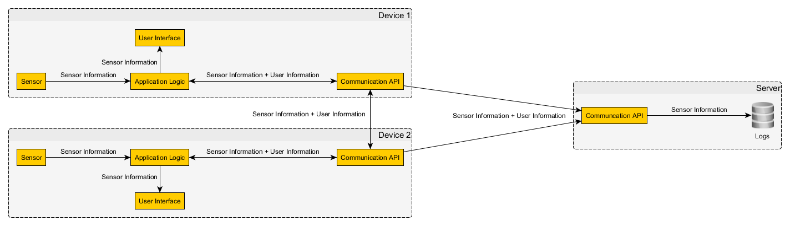
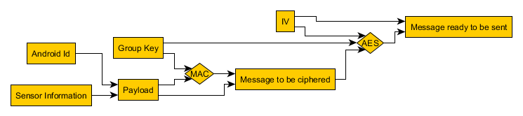
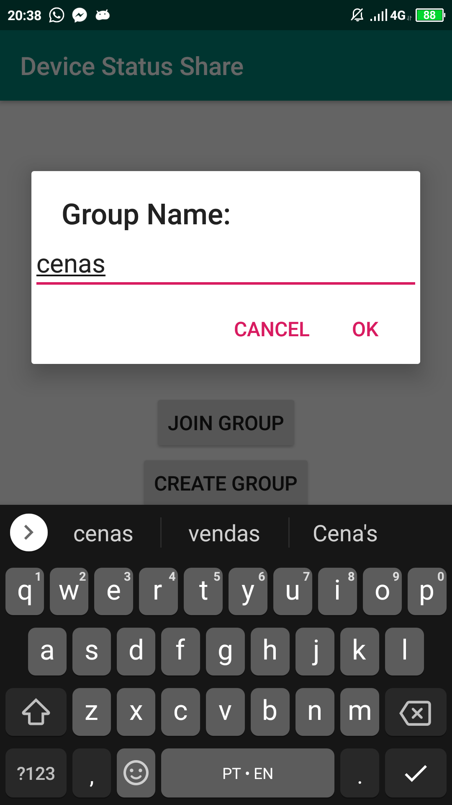
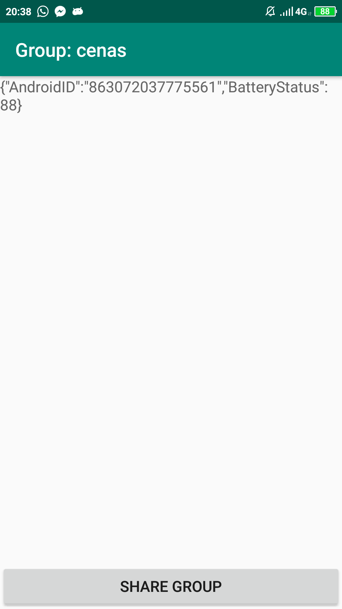
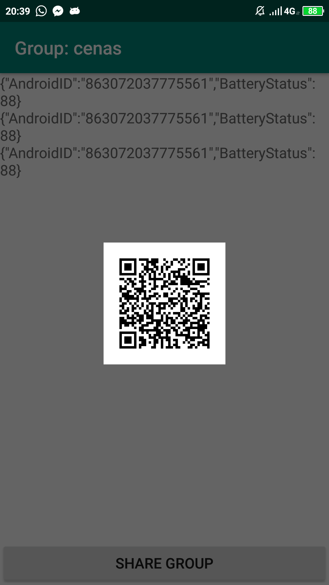

# DeviceStatusShare

The this application is a prototype made for a course of criptographic applications @dcc.fc.up.pt
The main goal of this project is to apply criptographic concepts to provide secure in simple applicaitons.

## Features

The main feature is to allow Android devices to share some of their device informations in a network with others.
This share can be considered secure as it has criptographic layers.

## How it works

A simplified version of the overall data flow can be seen in the diagram bellow.

### QR Code
The QR Code is used to share the communication group and has two values. A group name and a group secret key.

### Communication API
This module relies in two diferent concepts wich are a server and a client.
The client broadcasts a UDP packet to the whole network by setting the destination ip address 255.255.255.255
The server recieves UDP packets with destination ip address 255.255.255.255 and relays it to the application logic.

### Application Logic
This module offers two criptographic solutions to provide better security in the communication.
It provices functions to create one HMAC and to cypher using AES.
To create HMAC it is used the json message and the group secret key as inputs. The HMAC used in this project is the HmacSHA256.
To cypher using AES we choose to use in CBC mode with PKCS5PADDING. To do this it is an IV is created from the SecureRandom class.
Both these functions have the inverse functions wich are the HMAC confirm that calculates a new HMAC and the the decypher function that uses the shared group key to decrypt.
The two functions are combined to create the packet to broadcast as demonstrated in the following diagram.

The construction of the packet is done in two parts and the first one has 1 byte for the mac size followed by the mac and followed by the message. The second part is constituted by 1 byte for the IV length followed by the IV followed by the first part.

### Screenshots

